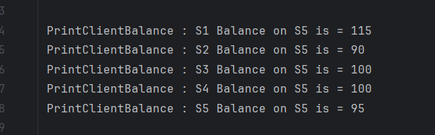

# Server Configurations

## Overview
This document outlines the configurations for the servers and the View Server responsible for handling transactions.

## Server Details
The following servers have been considered:

| Server Name          | Client Name | Port Number |
|----------------------|-------------|-------------|
| S1                   | A           | 8001        |
| S2                   | B           | 8002        |
| S3                   | C           | 8003        |
| S4                   | D           | 8004        |
| S5                   | E           | 8005        |
| Client / View Server |             | 8000        |

## View Server
This is actually not a View Server by definition. This is just a bridge between Input File and servers.

Like an Input Controller Client. This represents a Client that sends transactions to all the servers.

## Commands

| Command Names        | Command Details                                                                              |
|----------------------|----------------------------------------------------------------------------------------------|
| PrintDB              | Prints Database including current Log, Queue, Committed Blocks, and other important fields   |
| PrintBalance         | Prints Committed Balance of the Server and Local Account Balance                             |
| PrintLog             | Prints Current Local Transaction Log                                                         |
| PrintClientBalances  | Prints All Client Balances in perspective of the current server                              |
| Performance          | Prints Performance of the current Server - commit time, throughput of committed transactions |

## Execution Steps

1. Start the servers S1, S2, S3, S4, S5 and the View Server.
2. The View Server will read the input file and setup the input test sets.
3. The View Server terminal will prompt us to press 'Enter' to start the transactions.
4. Press 'Enter' to start the transactions of that set.
5. Each time we get to the next Set, we also run Commands: PrintDB and PrintBalance
6. Once all the test sets are completed, it will automatically trigger all commands: PrintDB, PrintBalance, PrintLog, PrintClientBalances and Performance
7. Logs/ ServerPortNumber-Commands.txt will be generated for each server with all the outputs of commands executed.
8. Logs/ ServerPortNumber-Common.txt has all common logs - all miscellaneous logs.
9. Logs/ Log-ServerPortNumber.txt has all the logs of the server. Consensus Phases, Transaction executions and other important logs.

## MongoDB Snapshot after execution

## PrintDB Command Output

## PrintClientBalances Command Output

## Performance Command Output

## PrintLog and PrintBalance Command Output

Note:
- The logs are generated in the Logs folder.
- Implementation is mostly from the Question sheet.
- Java code
- MongoDB for database. One thread will be backing up the state of server in parallel.
- Haven't used any direct references from internet.
- Intellij's copilot's suggestions were used in some parts of code during development.
- Just basic discussions about how the Paxos runs in this case and how the transactions are executed has been discussed with friends.
- The code is tested on the local machine and the logs are generated.